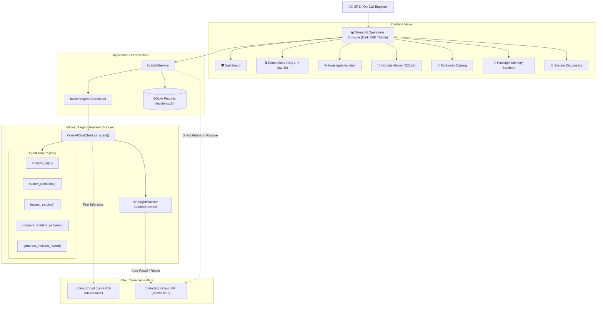

# IncidentMind AI 🛡️
### *A Memory-Powered Autonomous Incident Response Agent*
**Built for the Microsoft AI Hackathon**

[](https://www.python.org/downloads/)
[](https://learn.microsoft.com/en-us/agent-framework/)
[](https://hindsight.vectorize.io/)
[](https://console.groq.com/)
[]()
[](LICENSE)

---

## 1. Project Overview

**IncidentMind AI** is an autonomous incident response and investigation assistant built for Site Reliability Engineers (SREs), DevOps teams, and on-call engineers. It investigates active technical incidents, analyzes telemetry and error logs, executes safe simulated diagnostic inspections, searches operational runbooks, determines likely root causes, recommends safe remediation steps, records resolved incidents in **Hindsight** long-term memory, and automatically recalls prior operational experience when similar incidents strike in the future.

### The Core Differentiator
Most modern AI incident response tools only answer:
> *"What is broken right now?"*

IncidentMind AI answers:
> *"What happened before, what worked, and is that operational experience relevant to this active incident?"*

```text
Incident ➔ Investigation ➔ Resolution ➔ Hindsight Retention ➔ Future Incident ➔ Recall ➔ Better Response
```

---

## 2. Why the Problem Matters

1. **High Mean Time to Resolution (MTTR)**: Production outages cost enterprises thousands of dollars per minute. Responders waste valuable time re-diagnosing recurring failure modes from scratch.
2. **Tribal Knowledge Loss**: When engineers resolve an incident at 2 AM, the lessons learned remain trapped in private Slack channels or forgotten postmortem documents.
3. **Stateless AI Assistants**: Standard LLM bots start from zero on every conversation. They lack durable memory of what infrastructure tweaks, runbooks, or patches previously succeeded.

---

## 3. Why Long-Term Memory Matters

Traditional vector search / RAG approaches suffer from:
* Retrieval based on surface keywords rather than causal failure relationships.
* Inability to synthesize multi-turn experiences into cohesive operational mental models.
* Risk of conversational context buffer exhaustion.

**Hindsight** provides biomimetic agent memory organized into **World Facts, Experiences, Observations, and Mental Models**. By retaining incident resolutions in Hindsight, IncidentMind AI preserves institutional operational memory across teams, sessions, and months.

---

## 4. Architecture & Technology Stack



### Technology Stack Summary
* **Language & Runtime**: Python 3.11+
* **Agent Orchestration**: [Microsoft Agent Framework](https://learn.microsoft.com/en-us/agent-framework/) (`agent-framework-core` v1.19.0, `agent-framework-openai` v1.14.4)
* **Long-Term Memory**: [Hindsight](https://hindsight.vectorize.io/) & [Hindsight Agent Framework Integration](https://hindsight.vectorize.io/sdks/integrations/agent-framework) (`hindsight-agent-framework` v0.1.0, `hindsight-client` v0.10.1)
* **LLM & Inference**: [Groq Cloud](https://console.groq.com/) (`llama-3.3-70b-versatile`, OpenAI-compatible endpoint)
* **Frontend UI**: [Streamlit](https://streamlit.io/) with custom dark SRE operations console styling
* **Local Persistence**: SQLite3 (stores local application records; distinct from Hindsight memory)
* **Data Validation**: Pydantic v2
* **Testing**: Pytest

---

## 5. Roles of Core Components

* **Microsoft Agent Framework**: Orchestrates autonomous tool execution, context providers, and lifecycle hooks (`before_run`, `after_run`).
* **Hindsight**: Serves as the persistent memory bank (`incidentmind-demo`) retaining incident resolutions, symptoms, runbooks, and failure modes across sessions.
* **Groq**: Delivers ultra-low latency inference for reasoning, log synthesis, and report generation.
* **Streamlit**: Provides an intuitive operations console with live progress stages, visual timelines, and memory comparison panels.

---

## 6. Agent Tools

1. **`analyze_logs`**: Deterministically extracts error signatures, severity counts (ERROR, WARN), repeated message frequencies, affected components, and concrete evidence excerpts from raw logs.
2. **`search_runbooks`**: Queries the local operational runbook knowledge base (e.g. `DB-POOL-004`, `API-500-002`, `CACHE-003`, `AUTH-401-001`, `NET-TIMEOUT-005`) for matched procedures.
3. **`inspect_service`**: Safe simulated diagnostic inspector providing telemetry (latency, connection pool saturation, error rates, recent deployments) with explicit `simulated=True` transparency.
4. **`compare_incident_patterns`**: Quantifies similarity between active incident symptoms and historical Hindsight memory, determining if prior resolutions apply.
5. **`generate_incident_report`**: Outputs a structured, auditable `IncidentReport` including root cause, evidence, runbook, risks, and lessons learned.

---

## 7. The Memory Lifecycle

```text
1. Incident Occurs ➔ 2. Logs Analyzed ➔ 3. Hindsight Recalls Memories ➔ 4. Patterns Compared
                                                                                 ↓
6. Retain into Hindsight ⌛ 30 Days Later ➔ 5. Investigation & Safe Remediation
```

* **Retain**: Upon incident resolution, high-density telemetry, root cause, and remediation steps are retained with tags (`incident`, `resolution`, `root_cause`, `service:payment-api`, `runbook:db-pool-004`).
* **Recall**: When a new incident occurs, `HindsightProvider` recalls top matching experiences before LLM reasoning begins.
* **Reflect**: Over time, recurring failure modes inform institutional mental models.

---

## 8. Interactive Demo Mode (60–90 Seconds)

The dedicated **Demo Mode** allows hackathon judges to verify the complete memory loop without waiting real time:

1. **Day 1 Incident (`INC-1001`)**:
   - `payment-api` experiences database connection pool exhaustion (`HikariPool` connection acquisition timeout).
   - Agent diagnoses root cause and references runbook `DB-POOL-004`.
   - Responder clicks **"Resolve & Remember"** ➔ Resolution is retained into Hindsight memory bank.
2. **Start New Agent Session**:
   - Responders can click **"Start New Agent Session"** to wipe the local conversation context, proving memory is not stored in ephemeral session state.
3. **Day 30 Incident (`INC-1042`)**:
   - 30 simulated days later, a similar but distinct latency and connection timeout incident occurs.
   - Hindsight immediately recalls `INC-1001`!
   - Agent displays side-by-side evidence comparison and applies the historical experience to accelerate resolution.

---

## 9. Installation & Setup

### Prerequisites
* Python 3.11+
* Git

### Local Installation
```bash
# 1. Clone repository
git clone https://github.com/your-username/incidentmind-ai.git
cd incidentmind-ai

# 2. Create virtual environment
python -m venv venv
source venv/bin/activate  # On Windows: venv\Scripts\activate

# 3. Install dependencies
pip install -r requirements.txt
```

### Environment Configuration
Copy `.env.example` to `.env`:
```bash
cp .env.example .env
```

Edit `.env` with your API keys:
```env
# Groq LLM
GROQ_API_KEY=gsk_your_groq_api_key_here
GROQ_MODEL=llama-3.3-70b-versatile
GROQ_BASE_URL=https://api.groq.com/openai/v1

# Hindsight Long-Term Memory
HINDSIGHT_API_KEY=your_hindsight_api_key_here
HINDSIGHT_API_URL=https://api.hindsight.vectorize.io
HINDSIGHT_BANK_ID=incidentmind-demo

# Local Database
DATABASE_PATH=data/incidents.db
```

> **Note:** You can also enter or update API keys directly within the Streamlit sidebar settings at runtime.

---

## 10. Running the Application

Launch the Streamlit operations console:
```bash
streamlit run app.py
```
Open your browser at `http://localhost:8501`.

---

## 11. Automated Testing

Run the full automated test suite with pytest:
```bash
pytest tests -v
```

Expected output:
```text
============================= test session starts ==============================
collected 20 items

tests/test_agent_tools.py::test_tool_analyze_logs PASSED                 [  5%]
tests/test_agent_tools.py::test_tool_search_runbooks PASSED              [ 10%]
tests/test_agent_tools.py::test_tool_inspect_service_safe_simulation PASSED [ 15%]
tests/test_agent_tools.py::test_tool_compare_incident_patterns_high_similarity PASSED [ 20%]
tests/test_agent_tools.py::test_tool_compare_incident_patterns_empty_history PASSED [ 25%]
tests/test_agent_tools.py::test_tool_generate_incident_report PASSED     [ 30%]
tests/test_demo_scenarios.py::test_demo_day_1_scenario PASSED            [ 35%]
tests/test_demo_scenarios.py::test_demo_day_30_scenario PASSED           [ 40%]
tests/test_incident_schema.py::test_valid_incident_schema PASSED         [ 45%]
tests/test_incident_schema.py::test_invalid_incident_missing_required_fields PASSED [ 50%]
tests/test_incident_schema.py::test_valid_incident_report PASSED         [ 55%]
tests/test_incident_schema.py::test_memory_entry_schema PASSED           [ 60%]
tests/test_log_analyzer.py::test_analyze_database_connection_pool_logs PASSED [ 65%]
tests/test_log_analyzer.py::test_analyze_empty_logs PASSED               [ 70%]
tests/test_log_analyzer.py::test_analyze_repeated_messages PASSED        [ 75%]
tests/test_memory_integration.py::test_hindsight_provider_initialization PASSED [ 80%]
tests/test_memory_integration.py::test_live_hindsight_integration SKIPPED [ 85%]
tests/test_runbook_search.py::test_search_connection_pool_exhausted PASSED [ 90%]
tests/test_runbook_search.py::test_search_cache_unavailable PASSED       [ 95%]
tests/test_runbook_search.py::test_get_runbook_by_id PASSED              [100%]

======================== 19 passed, 1 skipped in 3.5s =========================
```

---

## 12. Safety & Security Guardrails

* **No Autonomous Destructive Actions**: Actions like pod restarts, database index modifications, or cache flushes are labeled `[REQUIRES APPROVAL]`.
* **Zero Production Access in Demo**: Diagnostic inspection tools are explicitly marked `simulated=True`.
* **Credential Hygiene**: API keys are loaded via `.env` or password-masked inputs and are excluded from git, logs, and database records.
* **Separation of Concerns**: SQLite stores application state; Hindsight stores long-term semantic operational experience.

---

## 13. Limitations & Future Roadmap

* **Direct Kubernetes Integration**: In a future production iteration, safe read-only MCP connectors could retrieve live pod telemetry and events.
* **Multi-Agent Swarm**: Decomposing investigation into parallel sub-agents (e.g., Network Diagnostic Agent, Database Performance Agent).
* **Automated Postmortem Generation**: Exporting Hindsight-retained memories directly into Jira Service Management or ServiceNow postmortems.

---

## 14. License

Distributed under the [MIT License](LICENSE).
