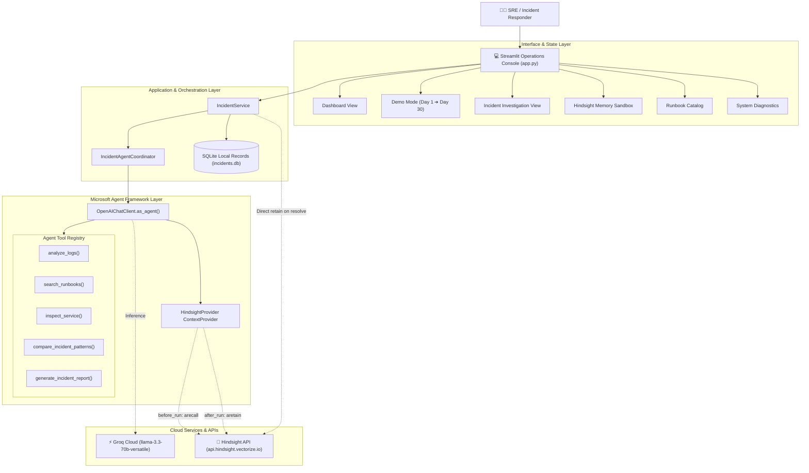

# Architecture Specification — IncidentMind AI

## 1. System Overview

**IncidentMind AI** is an autonomous incident response assistant built for Site Reliability Engineers (SREs) and DevOps teams. It orchestrates investigation workflows, analyzes telemetry logs, executes simulated diagnostic inspections, queries operational runbooks, and utilizes **Hindsight** biomimetic long-term memory to retain and recall operational experience across incidents.

### High-Level Architecture Diagram

---

## 2. Component Breakdown

### 2.1 Microsoft Agent Framework (`agent-framework-core`, `agent-framework-openai`)
* **Role**: Serves as the central autonomous execution runtime.
* **Client**: `agent_framework.openai.OpenAIChatClient` pointed to Groq's OpenAI-compatible base URL (`https://api.groq.com/openai/v1`).
* **Context Provider**: `hindsight_agent_framework.HindsightProvider` hooked into `before_run` and `after_run` lifecycle hooks.
* **Tool Invocation**: Deterministic function-calling tools mapped directly into the model's tool registry.

### 2.2 Hindsight Long-Term Memory (`hindsight-client`, `hindsight-agent-framework`)
* **Role**: Persistent experience bank surviving across sessions, user reboots, and simulated time intervals.
* **Bank Identifier**: `incidentmind-demo` (configurable via `HINDSIGHT_BANK_ID`).
* **Biomimetic Model**:
  * **Retain**: Encodes failure mode, root cause, symptoms, runbook applied, and lessons learned with strict operational tags.
  * **Recall**: Injects top semantic memories into instructions prior to LLM reasoning.
  * **Reflect**: Accumulates recurring failure signatures into holistic mental models.

### 2.3 Groq LLM Inference
* **Role**: Ultra-low-latency model inference provider.
* **Default Model**: `llama-3.3-70b-versatile` (fast tool calling, large context window).
* **Fallback**: Heuristic deterministic pipeline if API keys are not supplied.

### 2.4 Local Persistence (SQLite)
* **Role**: Stores structured application records (`Incident`, `IncidentReport`) for compliance and history.
* **Separation of Concerns**: SQLite stores local application data; Hindsight stores agent experience and semantic associative memory.

---

## 3. Investigation Sequence Diagram

```mermaid
sequenceDiagram
    autonumber
    actor SRE as SRE / User
    participant UI as Streamlit UI
    participant Svc as IncidentService
    participant Agent as Agent Framework
    participant Hindsight as Hindsight Cloud
    participant Groq as Groq LLM
    participant DB as SQLite DB

    SRE->>UI: Submit Incident (logs, service, symptoms)
    UI->>Svc: investigate(incident)
    Svc->>DB: save_incident(OPEN)
    
    rect rgb(20, 30, 45)
        note right of Svc: Stage 1-4: Deterministic Evidence Extraction
        Svc->>Svc: analyze_logs() & inspect_service()
        Svc->>Svc: search_runbooks()
    end

    rect rgb(30, 20, 45)
        note right of Svc: Stage 5-6: Hindsight Memory Recall
        Svc->>Hindsight: recall(query, tags)
        Hindsight-->>Svc: Recalled Memories (INC-1001)
        Svc->>Svc: compare_incident_patterns()
    end

    rect rgb(20, 40, 30)
        note right of Svc: Stage 7: Agent Framework Synthesis
        Svc->>Agent: run(prompt + recalled_memories)
        Agent->>Groq: Inference & Tool Calls
        Groq-->>Agent: Reasoning & Report
    end

    Svc->>DB: save_report(IncidentReport)
    Svc-->>UI: InvestigationContext (stages, report)
    UI-->>SRE: Display Evidence, Runbook, Historical Memory & Root Cause

    opt Resolve & Remember
        SRE->>UI: Click "Resolve & Remember"
        UI->>Svc: resolve_and_remember(incident_id, notes)
        Svc->>Hindsight: retain(content, tags)
        Svc->>DB: update_incident(RESOLVED)
        Hindsight-->>Svc: Retain Confirmation
        Svc-->>UI: Resolution Complete
    end
```

---

## 4. Trust Boundaries & Safety Model

1. **Simulated Infrastructure Safety**: The diagnostic tool `inspect_service` explicitly executes against internal deterministic mock states (`simulated=True`). No live cloud environments or production clusters are altered.
2. **Approval-Gated Remediation**: Any disruptive action (pod restart, connection pool resize, cache flush) is flagged with `[REQUIRES APPROVAL]` and is never run autonomously.
3. **Epistemic Distinctions**: The agent rigorously isolates observed evidence from historical recall, hypotheses, and proposed recommendations.
