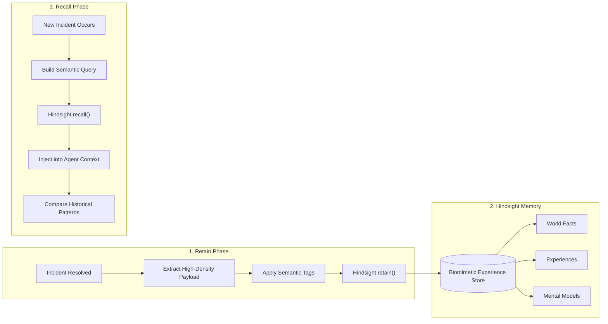

# Hindsight Memory Design & Architecture Specification

## 1. Why Long-Term Memory Matters in Incident Response

Traditional incident assistants and RAG systems suffer from two fatal limitations:
1. **Statelessness across incidents**: When an incident closes, all hard-won troubleshooting insights are discarded.
2. **Naive vector similarity**: Standard vector search returns chunks based on surface keyword similarity rather than causal relationships, failure modes, and operational efficacy.

**IncidentMind AI** leverages **Hindsight** (by Vectorize.io) to provide biomimetic long-term memory that retains, recalls, and reflects on technical failure patterns.

---

## 2. Memory Bank Topology

* **Default Bank ID**: `incidentmind-demo`
* **Scoping / Isolation**: Memory banks are isolated namespaces. Different engineering teams or staging environments configure dedicated bank IDs (e.g. `incidentmind-payments`, `incidentmind-infra`).
* **Mission**:
  ```text
  IncidentMind AI operational memory bank. Retains and recalls technical incidents,
  failure modes, observable symptoms, affected services, root causes, executed runbooks,
  and successful resolution steps to assist incident responders.
  ```

---

## 3. The Memory Lifecycle



---

## 4. Retention Payload Structure

When an incident is resolved via `resolve_and_remember()`, the memory service formats a dense semantic representation:

```text
Incident Record: INC-1001
Title: Payment API database connection failures
Service: payment-api
Severity: HIGH
Symptoms: failed to acquire database connection, connection pool exhausted, request timeout, database connection acquisition timeout
Root Cause: Database connection pool exhaustion caused by leaked connection sessions in checkout processing worker.
Runbook Applied: DB-POOL-004
Resolution: Investigated pool metrics; identified unclosed DB sessions in billing thread. Released leaked connections, temporarily raised max_connections from 50 to 100, and executed safe rolling restart of payment-api pods following DB-POOL-004 runbook. Verified pool latency stabilized at 4ms.
Lessons Learned: Database checkout handler was not releasing connections upon client timeout. Ensure all database transactions use strict context managers. Follow DB-POOL-004.
Key Evidence Logs:
2026-09-01 10:02:14 ERROR payment-api: failed to acquire database connection
2026-09-01 10:02:16 ERROR payment-api: connection pool exhausted
2026-09-01 10:02:19 WARN payment-api: request timeout
2026-09-01 10:02:21 ERROR payment-api: database connection acquisition timeout
```

---

## 5. Tagging Taxonomy

Memories are tagged to enable precise filtering without over-tagging:

| Tag Category | Format | Example | Purpose |
| :--- | :--- | :--- | :--- |
| **Record Type** | `incident`, `resolution`, `root_cause` | `resolution` | Distinguishes resolutions from ongoing logs |
| **Service Scope** | `service:<service-name>` | `service:payment-api` | Enables scoping to particular services |
| **Severity Level** | `severity:<level>` | `severity:high` | Helps prioritize severe historical precedents |
| **Runbook ID** | `runbook:<id>` | `runbook:db-pool-004` | Associates experience with procedural standard |

---

## 6. Recall & Injection Hook

Through `hindsight-agent-framework`:
* Before the agent reasons, `HindsightProvider.before_run()` calls `arecall()` using the incoming incident title, symptoms, and service name.
* Recalled memories are injected directly into the agent's instructions as a `## Memories` block.
* No tool-calling roundtrips are required by the LLM to access memory—it is present deterministically before reasoning begins.
* If Hindsight is temporarily unreachable, the provider fails gracefully without blocking the agent.
